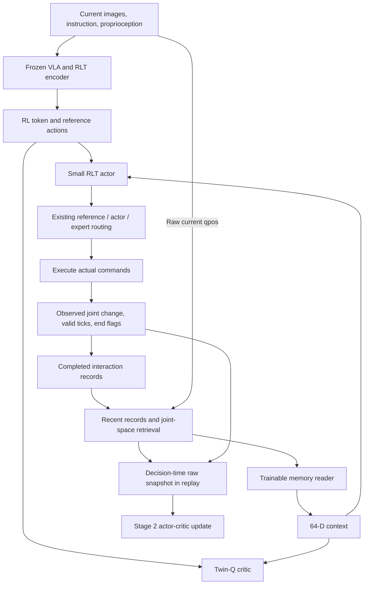

# Reading Completed Interaction Evidence in RLT

This design explains how the memory branch stores executed actions and observed outcomes, connects them to Stage 2, and separates implementation checks from evidence of learning. Reuse the original Stage 1 checkpoint, follow the decision loop below, then use the code map to inspect the implementation. This is a testable research prototype, not a validated performance improvement.

Branch: `research/rlt-zeva-interaction-memory`. Worktree: `/home/luokz/rlinf_rlt/UPT_zeva_dev`. Fixed baseline: `ff56663769fd00f6108c39195888f5d55cb8a737`. Neither FLARE nor VR changes were merged. The [2026-09-26 pilot results and architecture figure](PILOT_RESULTS.md) report subsequent GPU smoke, resume, the FSDP optimizer fix, and negative predictive-probe results; no convergence claim is made.

## 1. What Information Is Missing From Baseline RLT?

The baseline Stage 2 actor receives the current RL token, proprioception, and the VLA reference action. RL updates can accumulate experience in its parameters, but the actor has no explicit input describing which commands were just executed and how much the joints actually moved.

Two observations can look similar while their histories differ: a first approach versus repeated commands with little resulting motion. Recording commands and outcomes may distinguish these situations. Small motion is not, by itself, a contact label.

| Component | Fixed RLT baseline | Memory branch |
| --- | --- | --- |
| Stage 1 and RL token encoder/decoder | Original training | Unchanged; reused |
| Stage 2 VLA | Frozen token and reference extraction | Unchanged; no memory gradients |
| Actor input | Reference, RL token, proprioception | Original input plus 64-D context |
| Critic input | RL token, proprioception, candidate action | Original input plus context |
| Reward, BC/Q objectives, noise, routing | Baseline settings | Unchanged |
| Explicit experience | Existing replay | Bounded per-env store plus decision-time snapshots in replay |

The inspiration is Zeva's completed-interaction, storage, and context-reading loop. Zeva also uses a visual CTE, learned phase retrieval, and dedicated objectives. This branch does not reproduce those modules or its reported results. See the [official implementation](https://github.com/air-embodied-brain/Zeva) and [paper](https://arxiv.org/html/2608.30880v1).

## 2. How Does a Decision Use Memory?

Memory conditions the small actor and critic, not the VLA. The feedback edge below is allowed only after execution completes.



Let `R_t` denote raw evidence available at decision time and `m_t = Reader(q_t, R_t)` its learned 64-D context. Raw joint positions `q_t` are distinct from potentially transformed VLA `proprio`.

The actor consumes `[ref_chunk, z_rl, proprio, stopgrad(m_t)]`; the critic consumes `[z_rl, proprio, m_t, action_chunk]`. Concatenation happens in `_actor_state()` and `_critic_state()` in [rlt_mlp_policy.py](../../rlinf/models/embodiment/mlp_policy/rlt_mlp_policy.py). Actions remain 10×8; routing is unchanged.

## 3. What Does One Record Contain?

Evidence comes from an already completed environment interaction, not from asking an untrained encoder to invent physical knowledge. Joint-space evidence avoids extra VLA calls and large image histories.

| Segment | Dimensions | Meaning |
| --- | ---: | --- |
| Starting raw qpos | 9 | Seven Panda joints and two finger positions |
| Executed command prefix | 10×8 | Routed `pd_joint_delta_pos` commands clipped to [-1,1], matching ManiSkill's normalized controller; not unselected actor proposals |
| Observed qpos change | 9 | Real ending state minus starting state |
| Valid tick mask | 10 | Excludes the unexecuted terminal tail |
| Terminated / truncated | 2 | End conditions, not inferred success/contact causes |

The default record has 110 dimensions. `InteractionMemory.append_completed()` validates shapes, finite values, and normalized command bounds, padding unexecuted ticks with zeros. Do not subtract qpos change directly from normalized commands as a physical error: their units differ.

Records omit relative object poses, historical images, tactile/force sensing, and historical visual RL tokens. The original `z_rl` still supplies current visual information to actor/critic, but retrieval only compares qpos. Equal joint positions need not imply equal contact contexts; this is not a general contact knowledge base.

## 4. When Is Memory Written, Retrieved, or Cleared?

Each simulator lane owns an `InteractionMemory` through `JointMemoryCollector`. The rollout worker neither owns a mutable archive nor infers lane identity from reordered batches.

Defaults retain four recent records and an archive of the latest 32. Each snapshot carries four recent slots and four older retrieved slots, excluding duplicates. Retrieval ranks mean squared distance between recorded starting qpos and current qpos; ties prefer newer records. Recent slots are chronological, retrieved slots distance-ranked. Padding is masked. Similar records with contradictory outcomes are not averaged.

| Boundary | Default | Optional same-instance retries |
| --- | --- | --- |
| Ordinary reset / new instance | Clear recent and archive | Still clear |
| Same-instance retry | Also clear | Clear recent; retain archive |
| Partial vector reset | Only selected lanes reset | Same |
| Train versus eval | Separate environment stores | Same |
| Process restart | Start with empty environment memory | Archive not automatically restored |

Retention requires `retain_on_identical_reset=True` and train/eval `use_fixed_reset_state_ids=True`. The wrapper also fingerprints the reset simulator `get_state_dict()` and retains only an exact match. This checks the exposed state, not hidden mass/friction parameters omitted by the simulator; experiments must independently hold physical configuration fixed. Matching task names alone is insufficient.

`begin_attempt(instance_id, retry=True)` enforces identity at the lower-level API. `snapshot(query)` returns owned CPU tensors, so later writes cannot change old observations. `state_dict()` and `load_state_dict()` support schema-checked runtime snapshots for tests or future tools. Runtime archive persistence is not wired into Ray environment checkpoint recovery; exact mid-attempt resume is not claimed.

## 5. How Does the Reader Learn to Use Evidence?

A trained interface is necessary to turn raw records into useful conditions. `RLTMemoryEncoder` applies an MLP to each record, adds slot positions, queries these tokens using current raw qpos, and returns a 64-D attention context. Different positions distinguish recent and retrieved slots.

Empty memory returns exactly zero. Invalid slots are masked before the MLP, and the all-empty attention case avoids all-masked-key NaNs. No current action outcome is included before it occurs.

This ablation adds conditioning without a FLARE future-prediction loss or Zeva CTE loss. The reader learns through the existing critic TD objective; usefulness remains an empirical question.

| Signal | Updated parameters | Excluded parameters |
| --- | --- | --- |
| Critic TD loss | Twin-Q and `memory_encoder` | VLA and Stage 1 token encoder/decoder |
| Actor Q + BC loss | Actor backbone and action head | Memory reader and VLA |
| Slow target update | Target critic and target reader | No backpropagation |

Actor-side `detach()` is deliberate: the existing critic optimizer selects parameters containing `encoder`, so it owns this module. Actor gradients through Q with respect to actions still train the actor; they do not train the reader. One module is not assigned to two optimizers.

`algorithm.target_update_type=all` keeps target Q and its reader synchronized through slow updates. Validation rejects `q_head_only`, unverified CrossQ, and CUDA graphs. At evaluation, all network parameters can remain frozen while records accumulate; this tests context adaptation, but randomly initialized weights do not already possess that ability.

## 6. Why Does Replay Store Raw Snapshots?

The same observation with a different history can yield a different decision. Old transitions must retain their original evidence, not retrieve from today's archive.

Transport adds `memory_events [B,8,110]`, `memory_valid [B,8]`, and `memory_query [B,9]` to both current and real next observations. These pass through `EnvOutput`, rollout `forward_inputs`, `Trajectory.curr_obs/next_obs`, and existing replay. The learner re-encodes fixed evidence with its current reader; changing the representation is legitimate, introducing future evidence is not.

```text
Read R_t -> choose a_t -> execute commands
                              |
                       observe real q_next
                              |
          append (q_t, executed a_t, q_next - q_t)
                              |
       form R_next -> save transition -> reset if needed
```

If execution ends after three ticks, only those ticks and the real terminal state are recorded. Seven padded ticks do not count as additional actions. Recording precedes auto-reset, so reset memory belongs to the new episode, not the critic's terminal successor. Baseline termination, truncation, and bootstrap semantics are unchanged. Memory-enabled execution must enter through `chunk_step()`; direct wrapper `step()` calls are rejected to avoid losing chunk boundaries.

One default snapshot takes approximately 3.48 KiB; a current/next pair takes 6.96 KiB. At 50,000 transitions, these tensors alone add roughly 340 MiB, excluding trajectory copies, replay cache, and framework overhead. A bounded GPU smoke passed, but throughput and memory at this replay scale remain unmeasured.

## 7. How Are Checks and Experiments Prepared?

Run CPU tests and read-only preflight first. The worktree reuses baseline Python without installing another environment or changing dependencies. Commands are in [README.md](README.md); measured verification and remaining gates are in [VERIFICATION.md](VERIFICATION.md).

The sole overlay is [experiment/rlt_memory.yaml](../../examples/embodiment/config/experiment/rlt_memory.yaml), selected with `+experiment=rlt_memory` after an original config. Actor, rollout, train env, and eval env share a schema. The full baseline still needs real feature/expert model paths; the overlay changes neither budgets nor expert configuration.

| Comparison | Configuration or procedure | Question |
| --- | --- | --- |
| Original baseline | No overlay | Baseline performance |
| Disabled feature | `actor.model.interaction_memory.enabled=False` | Original architecture restored? |
| Recent only | `actor.model.interaction_memory.retrieval_size=0` | Is short history enough? |
| Recent plus archive | Default overlay | Does retrieval help? |
| Across retries | Enable retention, fix initialization and physics | Does another attempt use earlier evidence? |
| Fixed bank / shuffled history / parameter-matched model | Requires subsequent evaluation tooling | Separate capacity, spurious associations, and write benefits |

Changing enablement or retrieval size changes the network input or evidence schema; train those comparisons separately. A baseline Stage 2 checkpoint or old replay without memory fields cannot directly resume a memory-enabled run. Stage 1 checkpoints remain reusable. New Stage 2 checkpoints include reader weights under the existing actor/critic checkpoint layout.

## 8. What Would Demonstrate a Useful Improvement?

Start with peg insertion at matched data, interaction budgets, and intervention rules. Test repeated ineffective actions, recovery success, and steps to a predetermined success threshold across multiple seeds. Report environment steps, gradient updates, wall-clock time, interventions, and final success together.

Frozen-parameter retry evaluation should hold initialization and physics fixed, report per-attempt success, first-success attempt, pre-success recovery, and post-success reliability. Cumulative success alone is insufficient: a fixed independent success probability p already gives `1-(1-p)^K` success in K tries.

Diagnostics are `train/critic/memory_valid_records` and `train/critic/memory_empty_fraction`. Nonempty records prove transport, not appropriate use. Clearing or shuffling history is still needed to detect ignored memory or shortcuts through ending flags.

Cross-task transfer is not implemented. Separate unseen initial poses, objects/physical parameters, and genuinely new tasks with disjoint splits and no target-test evidence leakage. A later experiment can add completed visual `z_t/z_next` or reliable force evidence, revisiting storage, latency, and representation stability.

Keep FLARE separate until each mechanism has evidence. A future factorial comparison should include baseline, prediction only, memory only, and their combination. Prediction/outcome discrepancies could become additional records only after execution; that combination is neither implemented nor validated here.

## 9. Which Core Files Should You Read?

Start from recorded facts, then follow their influence on actions and finally the learning data path.

| Order | File and entry points | Focus |
| --- | --- | --- |
| 1 | [interaction_memory.py](../../rlinf/algorithms/rlt/interaction_memory.py): `InteractionMemory`, `JointMemoryCollector` | Records, retrieval, ownership, resets, snapshots |
| 2 | [rlt_memory_encoder.py](../../rlinf/models/embodiment/modules/rlt_memory_encoder.py): `forward` | Evidence to 64-D context |
| 3 | [rlt_mlp_policy.py](../../rlinf/models/embodiment/mlp_policy/rlt_mlp_policy.py): `_actor_state`, `_critic_state` | Conditioning and detach boundaries |
| 4 | [maniskill_rlt_env.py](../../rlinf/envs/sim/maniskill/maniskill_rlt_env.py): `reset`, `chunk_step` | Executed prefixes, terminal state, auto-reset |
| 5 | [rollout.py](../../rlinf/algorithms/rlt/rollout.py), [transition.py](../../rlinf/algorithms/rlt/transition.py) | Current/terminal snapshots into replay |
| 6 | [fsdp_rlt_ac_policy_worker.py](../../rlinf/workers/actor/fsdp_rlt_ac_policy_worker.py): `forward_critic`, `forward_actor` | Unchanged TD/Q/BC objectives, new diagnostics |
| 7 | [test_interaction_memory.py](../../tests/unit_tests/test_interaction_memory.py) | Time boundaries, gradients, weights, wrapper contracts |

Neither `pi0.py` nor the Stage 1 token transformer was changed. This tests interaction memory on a fixed RLT representation, not joint Stage 1 world-model training.
