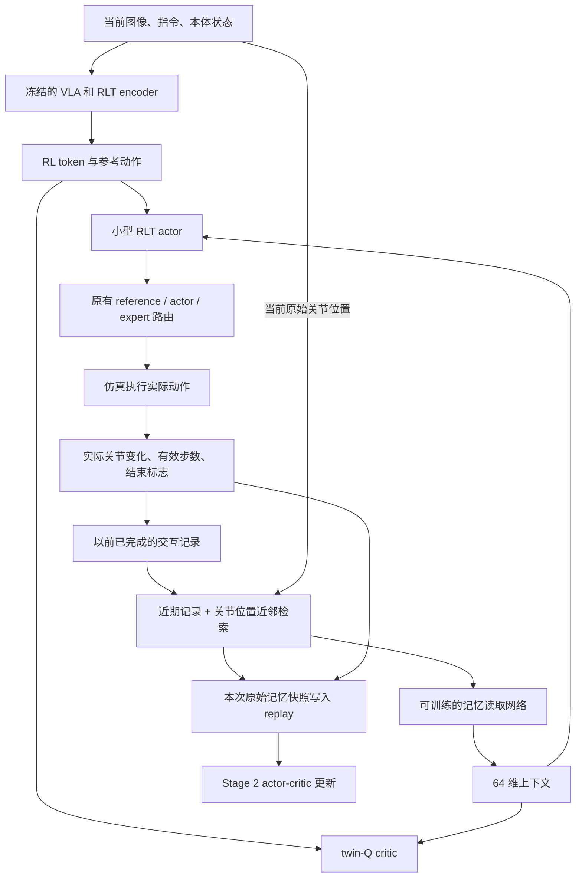

# 在 RLT 中读取已完成的交互经验

这份设计说明解释记忆分支如何保留动作与实际后果、怎样接入 Stage 2，以及哪些实验才能验证它是否帮助学习。你可以沿用原来的 Stage 1 权重，先理解下面的闭环，再按代码索引阅读实现。当前交付是可测试的研究原型，不是已经验证有效的算法。

分支为 `research/rlt-zeva-interaction-memory`，独立目录为 `/home/luokz/rlinf_rlt/UPT_zeva_dev`，起点固定为 baseline `ff56663769fd00f6108c39195888f5d55cb8a737`。没有合并 FLARE 或 VR 分支。后续的 [2026-09-26 小规模实验与架构图](PILOT_RESULTS.zh-CN.md) 记录了真实 GPU smoke、续跑、FSDP optimizer 修复与预测探针的负结果，尚无收敛优势的结论。

## 1. 原来的 RLT 缺少哪条信息？

baseline 的 Stage 2 在决策时读取当前 RL token、本体状态和 VLA 给出的参考动作。它的参数可以通过 RL 积累经验，但这个小型 actor 没有显式输入告诉它“刚才推了几次、每次实际移动了多少”。

例如，两次决策的当前图像和关节位置可能很接近，但一次是首次接近，另一次已经连续执行几个动作却变化很小。保存已执行的命令和真实变化，让 actor 有机会区分这两种情境。这是待验证的动机，不是“变化小必然发生了接触”的标签。

| 比较项 | 固定 RLT baseline | 当前记忆分支 |
| --- | --- | --- |
| Stage 1、RL token encoder/decoder | 原样训练 | 不修改，直接复用 |
| Stage 2 的 VLA | 冻结，输出 RL token 与参考动作 | 不修改，不接收记忆梯度 |
| actor 输入 | 参考动作、RL token、本体状态 | 原输入加 64 维记忆上下文 |
| critic 输入 | RL token、本体状态、候选动作 | 原输入加同一记忆上下文 |
| 奖励、BC/Q 目标、噪声、阶段切换 | baseline 设置 | 保持不变 |
| 实际经历的保存 | 原有 replay | 额外的每环境有界记忆；replay 保存当时的记忆快照 |

这里借鉴的是 Zeva 的“完成交互—保存证据—读取上下文”思路。Zeva 官方实现还有视觉 CTE、学习得到的阶段检索和专门训练目标；本分支没有复制这些模块，也不声称复现论文结果。[Zeva 方法与公开实现](https://github.com/air-embodied-brain/Zeva)、[论文](https://arxiv.org/html/2608.30880v1)。

## 2. 一次决策怎样使用记忆？

新增路径不进入 VLA，而是在小型 actor/critic 前提供上下文。图中实线表示本次决策，回路必须等动作执行完成后才能写入。



用符号区分“存储的记录”和“网络算出的向量”：`R_t` 是当前决策时已经知道的记录，`m_t = Reader(q_t, R_t)` 是 64 维向量。`q_t` 是原始关节位置；它不同于可能经 VLA 数据变换的 `proprio`。

actor 使用 `[ref_chunk, z_rl, proprio, stopgrad(m_t)]`，critic 使用 `[z_rl, proprio, m_t, action_chunk]`。输入拼接发生在 [rlt_mlp_policy.py](../../rlinf/models/embodiment/mlp_policy/rlt_mlp_policy.py) 的 `_actor_state()` 和 `_critic_state()`。actor 的输出形状仍为 10×8，路由接口没有改变。

## 3. 一条经验具体存什么？

记录来自已经完成的环境操作，而不是让一个随机 encoder 凭空产生“物理知识”。第一版选用关节控制证据，避免额外调用 VLA，也避免保存大量图像。

默认一条记录是 110 维向量：

| 片段 | 维度 | 来源与意义 |
| --- | ---: | --- |
| 开始时的原始关节位置 | 9 | Panda 的 7 个关节与 2 个手指位置 |
| 实际执行的命令序列 | 10×8 | 路由之后的 `pd_joint_delta_pos` 命令，按 ManiSkill 的归一化控制器规则截到 [-1,1]；不是未被选中的 actor 提案 |
| 执行后的关节位置变化 | 9 | 真实末状态减去开始状态 |
| 有效控制步 mask | 10 | 提前结束时，仅前面的实际执行步有效 |
| terminated / truncated | 2 | 区分自然结束与截断，不推断成功或接触原因 |

`InteractionMemory.append_completed()` 检查形状、有限数和命令范围，将未执行的尾部补零。不能直接计算“命令减去关节变化”当成物理误差：归一化命令和实际关节位移不在同一单位中。

这个选择也限制了能力：记录没有物体相对位姿、历史图像、触觉、力或视觉 RL token。当前图像信息仍通过原来的 `z_rl` 输入 actor/critic，但检索本身只看关节位置。相同关节姿态未必对应相同接触情境，因此这一版不能被称为通用接触知识库。

## 4. 如何保存、检索和清空？

每个并行环境有独立的 `InteractionMemory`，由环境侧的 `JointMemoryCollector` 管理。rollout worker 无需猜测批次重排后的环境身份，也不拥有可变的记忆库。

默认近期保留 4 条记录，有界 archive 保留最近 32 条。每次决策携带近期 4 条，再从不重复的旧记录中按开始关节位置与当前关节位置的均方距离检索 4 条。近期记录按时间排列；检索结果按距离排列，距离相同时优先较新的记录。未填满的槽位用 mask 屏蔽，不把相似但结果不同的记录平均成一条。

| 边界 | 默认行为 | 可选的同实例重试行为 |
| --- | --- | --- |
| 普通 reset、新实例 | 清空近期与 archive | 仍清空 |
| 同一实例重新尝试 | 默认也清空 | 清空近期，保留 archive |
| 仅部分环境 reset | 只重置对应环境的记忆 | 同左 |
| train 与 eval | 分属不同环境对象，不共享 | 同左 |
| 进程重新启动 | 从空环境记忆开始 | 不自动恢复旧 archive |

跨尝试保留需要显式开启 `retain_on_identical_reset=True`，并设置 train/eval 的 `use_fixed_reset_state_ids=True`。wrapper 还对 reset 后的模拟器 `get_state_dict()` 做精确 fingerprint 比较；匹配才保留。匹配只说明所检查的状态相同，不能证明未包含在 state dict 中的质量、摩擦等参数相同。实验还必须保证物理配置没有变化，不能仅凭 task 名相同就宣称同实例重试。

`begin_attempt(instance_id, retry=True)` 是底层的显式重试接口，身份不同会拒绝；`snapshot(query)` 返回独立 CPU tensor，后续写入不会改变旧快照。`state_dict()` / `load_state_dict()` 可供测试或未来恢复工具使用，含 schema 检查；目前没有把运行时 archive 自动接到 Ray 环境恢复，不能声称中途恢复完全等价。

## 5. 读取网络为什么可能学会利用这些证据？

原始记录必须经过训练过的网络才能成为有用条件。当前 `RLTMemoryEncoder` 先用 MLP 编码各条记录，再加入槽位位置参数，用当前原始关节位置生成 attention query，最后得到一个 64 维上下文。近期槽和检索槽具有不同位置，因此网络可以区分来源。

空记忆严格返回全零。mask 在 MLP 之前作用于无效槽，避免 padding 中的无效数污染 attention；全空时也不会出现所有 key 被屏蔽导致的 NaN。模型不会把一条尚未发生的结果放进当前输入。

这一版只增加条件信息，不额外增加 FLARE 的未来预测损失或 Zeva 的 CTE 损失。读取网络通过原有 critic 的 TD 目标学习，是否学到有用控制信息仍需要实验：

| 训练信号 | 更新的参数 | 不更新的参数 |
| --- | --- | --- |
| critic 的 TD loss | twin-Q、`memory_encoder` | VLA、Stage 1 RLT encoder/decoder |
| actor 的 Q + BC loss | actor backbone、动作输出层 | `memory_encoder`、VLA |
| target 的慢更新 | target critic 和 target 记忆读取网络 | 不通过反向传播更新 |

actor 路径的 `detach()` 是有意的：现有 critic optimizer 通过名称中的 `encoder` 收集这个网络；actor 只读取其输出，避免同一个模块被两个 optimizer 重复更新。actor loss 可以经过 Q 对动作的导数更新 actor，但不据此更新记忆读取器。

target 更新必须为 `algorithm.target_update_type=all`，使 target Q 所用的记忆表征也跟随慢更新。配置校验拒绝 `q_head_only`、未经验证的 CrossQ 和 CUDA graph 路径。训练结束后冻结全部网络参数，环境仍可写入新的记录，这才是单独检验上下文适应的评估模式；随机初始化后直接加记忆不代表已经获得这项能力。

## 6. replay 为什么保存原始快照？

带记忆后，同一个当前观测配上不同历史，可能对应不同决策。训练必须保留当时的信息，不能从现在的 archive 给旧 transition 重新检索。

实际传输的是三个固定 shape 的字段：`memory_events [B,8,110]`、`memory_valid [B,8]` 和 `memory_query [B,9]`。它们随当前观测和真实下一观测进入 `EnvOutput`、rollout `forward_inputs`、`Trajectory.curr_obs/next_obs`，最后进入原 replay。learner 用当前网络重新编码这些旧证据，这是正常的表征更新；证据本身不会替换成未来记录。

按一个 chunk 看时间顺序：

```text
读取 R_t → 得到动作 a_t → 环境执行 a_t
                           ↓
                 得到真实末状态 q_next
                           ↓
         写入 (q_t, 实际 a_t, q_next - q_t)
                           ↓
        生成 R_next → 保存 transition → 必要时 reset
```

例如第 3 个控制步结束，只有这 3 步和真实末状态被记入。后面 7 步只是 padding，不能解释为又执行了 7 次动作。自动 reset 之前完成写入和 terminal snapshot；reset 后的空记忆用于新 episode，而不是替代 critic 的真实下一状态。baseline 对终止、截断和 bootstrap 的处理保持不变。启用记忆后必须经 `chunk_step()` 执行；直接调用 wrapper 的 `step()` 会拒绝，避免丢失 chunk 边界。

默认每个原始快照约 3.48 KiB，当前和下一状态合计约 6.96 KiB；50,000 条 transition 约额外 340 MiB，仅计这些 tensor，不含轨迹副本、replay cache 和框架开销。有界 GPU smoke 已通过，但该 replay 规模下的吞吐与显存开销仍未实测。

## 7. 怎样运行检查和准备实验？

当前只应做 CPU 测试或只读预检。独立 worktree 不安装第二套环境，复用 baseline 的 Python；不会改动它的依赖。完整命令见 [README.zh-CN.md](README.zh-CN.md)，实际验收记录见 [VERIFICATION.md](VERIFICATION.md)。

配置只增加一个 overlay：[experiment/rlt_memory.yaml](../../examples/embodiment/config/experiment/rlt_memory.yaml)。在原 config 后添加 `+experiment=rlt_memory` 即可；actor、rollout、train/env、eval/env 使用同一个 memory schema。正式 baseline 仍包含需要填写的模型路径和 expert 配置，overlay 不替你启用新模型或修改训练预算。

| 对照 | 配置或操作 | 能回答什么 |
| --- | --- | --- |
| 原 baseline | 不添加 overlay | 原始方法性能 |
| 同分支关闭记忆 | `actor.model.interaction_memory.enabled=False` | 关闭路径是否回到原结构 |
| 仅近期记录 | `actor.model.interaction_memory.retrieval_size=0` | 简短历史是否已经足够 |
| 近期 + 旧记录 | 默认 overlay | 检索是否有额外作用 |
| 跨尝试保留 | 显式开启保留、固定初始化并核对物理条件 | 下一次尝试是否利用旧经验 |
| 固定库 / 打乱记忆 / 等参数量对照 | 后续实验需增加相应评估工具 | 排除更多参数、错误相关性和持续写入以外的收益 |

开关、检索数量改变后，输入结构或 evidence schema 可能变化，应分别训练；不能把不同大小网络的 Stage 2 checkpoint 混用。旧 baseline Stage 2 MLP checkpoint、旧 replay 缺少记忆字段，不能直接用于带记忆的续跑。Stage 1 checkpoint 可以复用；带记忆的 Stage 2 checkpoint 包含读取器权重，原有 actor/critic checkpoint 保存路径不变。

## 8. 怎样判断它真的帮助了学习？

先在同一插销任务回答小问题：相同数据、交互预算和干预规则下，记忆是否减少重复无效操作，提高恢复成功率，或更快达到预设成功率。至少用多个 seed，并同时报告环境交互次数、梯度更新次数、墙钟时间、干预次数和最终成功率。

冻结参数的重试实验需要固定一组初始化和物理条件，比较每一次尝试的成功率、首次成功所需尝试数、首次成功前的失败恢复，以及成功后的稳定性。不能只展示累计成功率：即使单次成功率恒为 p，独立尝试 K 次至少成功一次的概率仍是 `1-(1-p)^K`。

上线后的诊断项是 `train/critic/memory_valid_records` 和 `train/critic/memory_empty_fraction`。有记录只证明数据进入训练，不能证明网络合理使用了记录；还需要清空或打乱记忆的行为对照，防止模型忽略记忆或利用结束标志等捷径。

原计划中的跨任务迁移尚未实现。下一步先区分同任务新初始姿态、新物体或物理参数与真正新任务；后者要求独立任务划分，不能共享目标任务测试轨迹。要从关节历史走向更完整的接触经验，可以在独立实验中加入已完成交互的视觉 `z_t/z_next` 或可靠的力觉证据，并重新评估存储、延迟和目标稳定性。

FLARE 分支暂不合并。未来可保持同一 baseline，分别比较 baseline、预测、记忆、预测加记忆；组合时再把预测与实际结果的偏差作为附加证据，且只在执行完成后写入。这个组合是后续假设，不是本次已实现或已验证的能力。

## 9. 按什么顺序读核心代码？

从动作执行后的事实记录开始，再看它怎样影响动作，最后追踪训练数据，最容易建立完整理解。

| 顺序 | 文件与入口 | 关注点 |
| --- | --- | --- |
| 1 | [interaction_memory.py](../../rlinf/algorithms/rlt/interaction_memory.py)：`InteractionMemory`、`JointMemoryCollector` | 内容、检索、所有权、reset、快照 |
| 2 | [rlt_memory_encoder.py](../../rlinf/models/embodiment/modules/rlt_memory_encoder.py)：`RLTMemoryEncoder.forward` | 记录怎样变成 64 维向量 |
| 3 | [rlt_mlp_policy.py](../../rlinf/models/embodiment/mlp_policy/rlt_mlp_policy.py)：`_actor_state`、`_critic_state` | 拼接位置、`detach()`、原网络保留 |
| 4 | [maniskill_rlt_env.py](../../rlinf/envs/sim/maniskill/maniskill_rlt_env.py)：`reset`、`chunk_step` | 实际动作前缀、终止、自动 reset |
| 5 | [rollout.py](../../rlinf/algorithms/rlt/rollout.py) 与 [transition.py](../../rlinf/algorithms/rlt/transition.py) | 当前与 terminal 记忆进入 replay |
| 6 | [fsdp_rlt_ac_policy_worker.py](../../rlinf/workers/actor/fsdp_rlt_ac_policy_worker.py)：`forward_critic`、`forward_actor` | 沿用 TD 与 Q/BC 目标，新增诊断指标 |
| 7 | [test_interaction_memory.py](../../tests/unit_tests/test_interaction_memory.py) | 时间边界、梯度、权重保存、wrapper 验证 |

本次没有修改 `pi0.py` 或 Stage 1 RLT token transformer。这是“在固定 RLT 表征上检验交互记忆”的实现，不是把 Stage 1 改造成联合世界模型训练。
