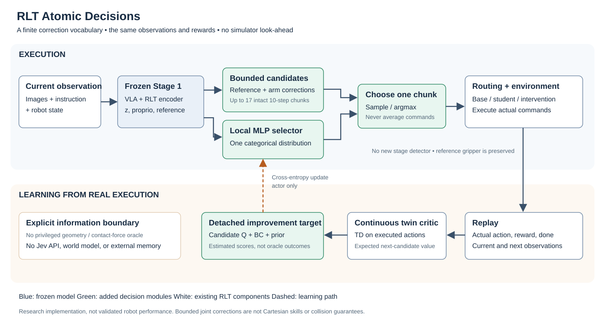

# Learning to select bounded action corrections

This branch tests whether a finite correction vocabulary can reduce unproductive exploration under the same RLT observations, frozen VLA and reward. **RLT Atomic Decisions** branches from baseline `d9ba471e` as `research/rlt-jev-atomic-decisions`. It borrows Jev's bounded-decision interface, not its model or unpublished training recipe. Read the execution path first, then the learning objectives and verification commands. CPU checks and configuration preflight are complete; real ManiSkill, GPU/FSDP execution and transfer remain unverified.



## What remains unchanged

Stage 1 still learns the VLA and RL-token encoder. Stage 2 freezes them and consumes `z_rl` (2048), transformed `proprio` (9), and a 10 × 8 reference chunk (seven joint controls and one gripper control). See [`extract_rlt_obs`](../../rlinf/models/embodiment/openpi/tasks/eval.py); ManiSkill proprioception is transformed model input, not raw joint angles.

Rewards, episode boundaries, routing and intervention labels remain baseline behavior. The shipped smoke uses the baseline `full_task`/`always_on` route with automatic expert disabled. It does not introduce stage detection or integrate the separate VR branch.

## What the actor selects

Instead of generating 80 continuous values, the actor selects one of up to 17 reference-relative chunks: reference, bounded arm damping, bounded braking, and positive/negative corrections for each of seven joints. [`JointActionCandidates`](../../rlinf/models/embodiment/modules/rlt_action_candidates.py) clips the reference to `[-1,1]`, bounds each per-step correction by `radius=0.08`, and clips final commands to the same range. These are normalized `pd_joint_delta_pos` controls, not Cartesian displacement, force or radians.

Damping moves toward half the reference; braking moves toward zero subject to the same radius. Neither is an emergency stop. The gripper always inherits the clipped reference, so this version cannot correct reference gripper mistakes. Identical candidates are masked, with the reference kept first. Joint corrections are not world-frame movement primitives, and repeated corrections can accumulate. Bounded actions are not a collision-safety guarantee.

[`RLTAtomicPolicy`](../../rlinf/models/embodiment/mlp_policy/rlt_atomic_policy.py) retains a three-layer, 256-wide MLP and produces logits over candidates. The initial valid reference usually receives at least 90% probability. Training samples one candidate; evaluation selects the highest-probability candidate. Execution never averages candidate commands. Proposal IDs and distributions are logged separately from routed, actually executed actions.

## How feedback updates the model

Experience is retained in critic and selector parameters. The original replay stores current observations, executed actions, rewards, done flags and next observations; this version adds neither long-term memory nor a contact/world model. The continuous-action critic can train on interventions outside the candidate vocabulary.

Its bootstrap is an exact finite expectation under the online selector and target twin critic:

```text
V_next = Σ_k p_online(k | next_obs) min(Q1_target(next_obs,a_k), Q2_target(...))
y = Σ_i γ^i r_i + (1-done) γ^n V_next
L_critic = mean((Q(obs, actual_action) - y)²)
```

The reward vector determines `n`; it is not hard-coded to ten. Simulator done includes termination and truncation, preserving baseline terminal masking rather than bootstrapping through reset. Candidate Q values are estimates, not outcomes observed by running counterfactual simulations.

The selector learns a detached improvement distribution:

```text
c_k = -w_Q Q1(obs,a_k) + w_BC BC_k + λ |Q1-Q2|
p_target(k) = softmax(log p_prior(k) - c_k / temperature)
L_selector = -Σ_k stop_gradient(p_target(k)) log p_selector(k)
```

BC targets the reference on ordinary steps and the executed intervention on labeled steps. Baseline BC/Q weights and schedules remain available. `atomic_temperature=0.1` controls concentration; `atomic_disagreement_weight=0` disables the optional twin-Q disagreement penalty by default. Choice probabilities are not calibrated success probabilities; disagreement is not calibrated physical risk.

See [`atomic_decision.py`](../../rlinf/algorithms/rlt/atomic_decision.py) and the dispatch in [`RLTACLossMixin`](../../rlinf/workers/actor/fsdp_rlt_ac_policy_worker.py). Critic TD updates critic parameters; selector cross-entropy updates the actor backbone and selector. Candidates, improvement targets and VLA inputs are detached. Reference dropout affects selector conditioning, not candidate construction or BC targets.

The worker clears the other optimizer's stale gradients before each update phase, so whole-model clipping measures only the active parameters. This behavior is enabled only for the new feature. CPU tests exercise the real worker update method; distributed FSDP behavior still needs GPU verification.

This deliberately changes the action space, actor objective and target expectation. It is not an unchanged RLT objective with a differently shaped head.

## Why the first objective was replaced

The prototype minimized `Σ p_k c_k` directly. In a CPU toy task, early incorrect choices became saturated and remained incorrect after 1000 updates even when the critic had improved. Distilling the full improvement distribution retains a corrective gradient for a low-probability candidate.

The CPU tool preserves `--actor-update expected-cost` for reproducing this failed prototype; production uses distillation. This one-step quadratic task has good action coverage and no collisions, images or peg-insertion dynamics. Its result verifies learning machinery, not robotic sample efficiency.

## What is borrowed

The research combines established ideas; experimental value and novelty remain questions to test.

| Source | Borrowed idea | Boundary |
| --- | --- | --- |
| [Jev interface](https://docs.typesafe.ai/introduction) | Typed finite decisions and probabilities | Local RLT features and MLP; no Jev API or model reproduction |
| [jev-libero architecture](https://github.com/Dimweaker/jev-libero/blob/main/docs/architecture.md) | Separate candidate construction, selection and execution | No geometry/contact-force oracle or simulator previews; its videos omit API/preview waiting |
| [Residual RL](https://arxiv.org/abs/1812.03201) | Correct an existing control prior | Discrete bounded corrections around frozen VLA chunks |
| [SayCan](https://arxiv.org/abs/2204.01691) | Ground selection using executable capabilities/value | Fine-grained joint corrections, not complete language-level skills |
| [Q-chunking](https://arxiv.org/abs/2507.07969) | Couple chunked actions and temporal value learning | Fixed chunk duration to avoid confounding horizon changes |

FLARE investigates consequence prediction; Zeva investigates conditioning on interaction history; this branch investigates the decision space. Keep separate comparisons before combining a future predictor or memory with candidate selection.

## What would support further development

Compare continuous RLT and this branch with identical Stage 1 weights, tasks, seeds, environment counts, episode length, VLA call frequency, rewards and intervention budgets. Report environment steps, learner updates and wall-clock cost separately. A 500-control-step episode is not 500 learner updates.

Then ablate reference-only, uniform candidates, learned selection, reference prior, radius, temperature and disagreement penalty. Include a continuous residual actor constrained to the same bounds to distinguish restricted exploration from discretization. These are planned experiments, not a completed automated benchmark suite.

Measure success learning curves/AUC, interactions to a target success rate, intervention count/duration, deviations, candidate usage, `atomic/bc_error_floor` and full latency. A large minimum BC error means the vocabulary cannot express an intervention. Never relabel that action as a successful candidate. Baseline intervention handling replaces parts of reference conditioning, so interpret this diagnostic together with intervention flags.

Predicted candidate outcomes are not observed counterfactual labels. Transfer requires held-out objects/tasks and separate frozen versus adapted evaluations. RLT already has a small MLP actor; lower inference latency is not guaranteed, and training adds scoring of up to 17 candidates.

## Verify without starting a job

Run the CPU checks and read-only asset/config preflight in the independent worktree:

```bash
cd /home/luokz/rlinf_rlt/UPT_jev_dev
export RLINF_VENV=/home/luokz/rlinf_rlt/UPT_dev/.venv
export PYTHONPATH="$PWD:${PYTHONPATH:-}"
CUDA_VISIBLE_DEVICES='' OMP_NUM_THREADS=1 OPENBLAS_NUM_THREADS=1 MKL_NUM_THREADS=1 \
  "$RLINF_VENV/bin/python" -m pytest tests/unit_tests/test_atomic_decision.py -q
bash run_rlt_atomic_gpu2.sh --check
```

Reproduce the CPU learning check with three seeds per command. These JSON reports are synthetic verification, not robot success rates:

```bash
CUDA_VISIBLE_DEVICES='' OMP_NUM_THREADS=1 OPENBLAS_NUM_THREADS=1 MKL_NUM_THREADS=1 \
  "$RLINF_VENV/bin/python" -m toolkits.rlt.atomic_cpu_smoke --steps 1000 --actor-update distill
CUDA_VISIBLE_DEVICES='' OMP_NUM_THREADS=1 OPENBLAS_NUM_THREADS=1 MKL_NUM_THREADS=1 \
  "$RLINF_VENV/bin/python" -m toolkits.rlt.atomic_cpu_smoke --steps 1000 --actor-update expected-cost
```

When GPU validation is explicitly scheduled, run `bash run_rlt_atomic_gpu2.sh --probe` before `bash run_rlt_atomic_gpu2.sh --run`. Neither was executed during this development. No arguments means preflight only. The default run has two outer iterations; `RLT_ATOMIC_STEPS` permits 1–20. The launcher rejects a busy GPU 2, uses an isolated Ray port (6512), and cleans up only owned child processes. Its cooperative lock cannot prevent unrelated launchers racing after the busy check; coordinate GPU scheduling.

[`maniskill_rlt_stage2_atomic_gpu2.yaml`](../../examples/embodiment/config/maniskill_rlt_stage2_atomic_gpu2.yaml) uses two train environments, one eval environment, 500-control-step episodes, global batch four and micro batch two. Local TensorBoard logs go under `$RLT_STORAGE/runs/atomic_smoke/`, with the runner's normal checkpoint layout. The feature model loads Stage 1 step 2000; selector/critic initialize from scratch. A continuous baseline Stage 2 checkpoint is not a valid atomic actor resume checkpoint.

See [JEV_VERIFICATION.md](JEV_VERIFICATION.md) for checked scope and pending GPU validation. No changes were merged into baseline, FLARE, Zeva or VR.
