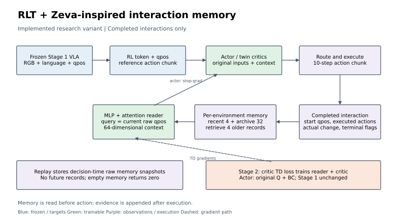

# 动作后果表征：小规模实验与验收

这份记录说明 2026-09-26 对真实示范和 Stage 2 链路的验证：新增的增量预测版通过独立轨迹测试，原预测版和增量版都已完成真实 GPU smoke，但尚未证明在线 RL 收敛更快。先理解方法与修正，再看实验边界和重现入口。[English](PILOT_RESULTS.md)

## 新增网络究竟学什么

冻结 Stage 1 VLA 后，当前图像、语言和关节状态得到 RL token `z_t` 与本体状态 `p_t`。小型 encoder 把它们编码成 `e_t`；Transformer 读取 `[e_t, 已执行动作前缀, future query_h]`，预测真实执行后 `h` 步的 RL token 和关节变化。未来标签来自轨迹中实际的未来观测，通过同一冻结 VLA 提取，不是从一个生成视频模型伪造未来。



图为当前研究实现，不是 FLARE 原图。蓝色模块冻结，绿色网络可训练，虚线表示梯度。可编辑 [SVG](figures/architecture.svg)、排版用 [PDF](figures/architecture.pdf) 和 [PNG](figures/architecture.png) 均已提供；执行 `python experiments/maniskill_rlt/draw_architecture.py` 可重新生成。

Stage 1B 用真实示范学习预测器，并保留原来的 anchor/BC 辅助项。Stage 2 把当前 `e_t` 拼接给 actor/critic；critic TD loss 与真实 replay 的未来辅助 loss 继续更新小模块，actor 的上下文经过 `detach()`。VLA 始终冻结。在线只对完整 10 步 chunk 的有效非终止 successor 计算未来监督，不把 reset 状态当作未来。

借鉴 [FLARE 官方方法](https://research.nvidia.com/labs/gear/flare/) 的核心是用未来表征监督动作相关特征。FLARE 把 future token 放进动作去噪网络，并联合动作 flow-matching 目标训练；本实现使用冻结 RLT 的外挂网络，当前特征进入 actor/critic，未来预测是辅助监督，不直接生成视频、不联合修改 VLA，也不是 FLARE 的完整复现。

## 实验为何增加了增量预测

原预测器直接回归未来 token。第一轮验证发现，1 步预测误差 0.07058，明显差于直接假设状态不变的 0.01450。相邻帧的大部分信息不变，让模型从头重建整条 token 会浪费小预算。

新增 `LatentWorldConfig.predict_residual=True` 后，预测变为：

```text
预测未来 token = LayerNorm(当前 token) + 网络预测的变化量
```

变化量输出层零初始化，初始性能等于“状态保持不变”；训练再学习动作引起的偏离。输入 token 被 detach，梯度只更新外挂网络。关节变化目标、网络主干、数据划分和训练预算不变。默认值仍为 `False`，旧 checkpoint 行为不变；开关随 sidecar checkpoint 保存，Stage 2 自动读取。

## 独立轨迹上看到了什么

固定 Stage 1 step 750 checkpoint，导出完整 episodes 0–11，其中 1/6/9 用于验证和选模型，其余 9 条用于训练。训练 300 次 optimizer 更新，batch 32、micro-batch 16、seed 2026。另导出 episodes 12–23，仅用于测试，没有参与训练或选模型。缓存校验冻结模型、归一化、预处理和源数据哈希，并拒绝测试集与训练/验证 episode 重叠。

原版与增量版都在同一物理 L40 GPU 2 上训练，均用各自验证集选出的 `best.pt`，并在 CPU 上按相同流程测试。早期 CPU 增量试验只作为探索记录，不用它与 GPU 原版作最终比较。

下表为独立测试集的未来 RL token cosine error，越低越好。测试有效目标数分别为 905、857、797；同一 episode 内样本相关，不应当作独立试验次数。

| 预测跨度 | 保持当前状态 | 原直接预测 | 新增增量预测 | 增量版、打乱动作 |
| --- | --- | --- | --- | --- |
| 1 步 | 0.012456 | 0.074895 | **0.010676** | 0.012794 |
| 5 步 | 0.071462 | 0.074809 | **0.030102** | 0.084986 |
| 10 步 | 0.158003 | 0.074135 | **0.045826** | 0.169292 |

结果支持“增量形式更适合这个小预算，动作输入对预测有作用”。它不证明发现了物理规律，更不证明降低干预次数、提高成功率或跨任务迁移。打乱动作会制造分布偏移，只是敏感性诊断，不是因果识别。当前仅一个 seed、单任务和少量成功示范；需要多种子与固定交互预算的在线对照。

预测头分歧与误差的相关性不是安全置信度。原版验证集 10 步相关性约为 -0.0017；增量版独立测试约 0.4644，仍未经校准。因此探索范围约束保持关闭，不用这些数值自动收紧探索。

## 在线链路与回归验证

原版 sidecar 的 Stage 2 smoke 完成 2 个全局 step，50/54 个 `latent_world.*` 张量更新。4 个不变张量属于仅离线使用的 BC head，符合预期。增量 sidecar 也通过相同的真实 GPU smoke。launcher 现在审计相邻 checkpoint 的模块更新，不再只看退出码；overlay 强制 FSDP `use_orig_params=True`，保证按名称分配 optimizer 参数。

增量版还从 step 2 恢复到 step 4，退出码 0；两个 optimizer 的 step 从 4 增至 8，确认保留状态继续更新。恢复后的 checkpoint 审计继续通过。

同一分支关闭外挂模块的 2-step smoke 也退出 0，验证了 opt-in 关闭路径；这不是成功率消融，短 episode 和极少更新不足以比较控制能力。

CPU 回归为 **188 passed、1 skipped、1 deselected**，覆盖残差初始化、梯度、cache episode 选择、独立测试拒绝泄漏、Stage 1B 精确续跑和 checkpoint 审计。跳过原有可选 Gemma3 检查，排除 baseline 已存在的 `VideoMetadata` 依赖不兼容测试。中英文 Sphinx 构建均 0 warning；没有修改 docs RST 树，仓库原有静态 markup/symbol 提示未纳入本次修复。

实验仅使用 GPU 2，CUDA、Ray placement 与 Vulkan PCI 设备同时隔离。GPU 0/1 的 baseline 进程没有停止或重启。Stage 2 每次只有 2 个训练环境、1 个评估环境、40 控制步 episode；这验证 rollout→replay→更新→权重同步→checkpoint，不用于判断成功率。

## 重现与代码入口

先检查，再显式运行。使用已有 Python 环境，不安装或升级依赖。`RLT_WORLD_CHECKPOINT` 指向 Stage 1B 的 sidecar，而不是 VLA 权重；VLA 默认仍使用固定的 step 750。

```bash
cd /home/luokz/rlinf_rlt/UPT_flare_dev
export RLINF_VENV=/home/luokz/rlinf_rlt/UPT_dev/.venv
export RLT_WORLD_CHECKPOINT=/mnt/nas_ailab_434/Personal_File/luokz/rlinf_rlt_maniskill/research/flare_residual_gpu_20260926/stage1b/best.pt
bash run_rlt_stage2_smoke_gpu2.sh --world --check
RLT_SMOKE_RAY_PORT=6412 bash run_rlt_stage2_smoke_gpu2.sh --world
```

只有最后一条会启动真实 smoke。GPU 2 忙碌时拒绝启动；不会执行全局 `ray stop`。`RLT_SMOKE_STEPS` 为 1–20 的停止全局 step；`RLT_SMOKE_RESUME_DIR` 可设为已有 `global_step_N`，停止 step 至少再增加 2。续跑恢复模型、optimizer、scheduler、target 和 replay，不保证模拟器状态逐帧延续。

离线初试用 `python -m toolkits.rlt.run_offline_pilot --output NEW_OUTPUT`，需显式 `CUDA_VISIBLE_DEVICES=2`，并设置 `RLT_DATASET`、`RLT_NORM_STATS`、`RLT_STAGE1_CHECKPOINT`。它导出 12 条完整轨迹并训练 300 步；输出必须是新目录。`python -m toolkits.rlt.compare_latent_variants --original-config TRAIN_CONFIG --output NEW_OUTPUT --device cuda:0` 使用相同 cache 和预算训练增量版。独立测试入口为 `python -m toolkits.rlt.evaluate_latent_world --checkpoint SIDECAR --cache-dir TEST_CACHE --independent-test`。

核心阅读顺序：`toolkits/rlt/cache_latents.py` 提取真实时序标签 → `rlinf/models/embodiment/modules/rlt_latent_world.py` 定义外挂网络 → `toolkits/rlt/train_latent_world.py` 离线训练 → `rlinf/algorithms/rlt/latent_world.py` 校验在线时间边界 → `rlinf/workers/actor/fsdp_rlt_ac_policy_worker.py` 联合 TD/未来 loss。`toolkits/rlt/audit_adapter.py` 检查真实参数变化。

大文件均保存在 NAS 根目录 `/mnt/nas_ailab_434/Personal_File/luokz/rlinf_rlt_maniskill`，未提交到 Git：

| 相对目录 | 内容 |
| --- | --- |
| `research/flare_pilot_20260926_2230` | 原版 cache、解析后的配置、Stage 1B checkpoint、验证与独立测试 JSON |
| `research/flare_residual_20260926_2242` | CPU 增量探索记录，不用于最终同设备对比 |
| `research/flare_residual_gpu_20260926` | GPU 增量版及独立测试 JSON |
| `research/flare_test_cache_20260926` | episodes 12–23 的独立 cache |
| `runs/stage2_smoke/stage2_gpu2_20260926_223122_3015384` | 原版 Stage 2 smoke |
| `runs/stage2_smoke/stage2_gpu2_20260926_224446_3058816` | 增量版 Stage 2 smoke |
| `runs/stage2_smoke/stage2_gpu2_20260926_224923_3072010` | 增量版从 step 2 到 4 的续跑 |
| `runs/stage2_smoke/stage2_gpu2_20260926_225351_3086762` | 关闭外挂模块的 2-step smoke |

分支保持 `research/rlt-flare-latent-dynamics`，仅 cherry-pick baseline 的资源隔离与恢复修复 `ff566637`，对应本分支提交 `43a0e615`。没有合并 Zeva/VR，也没有修改正在训练的 baseline 工作区。
